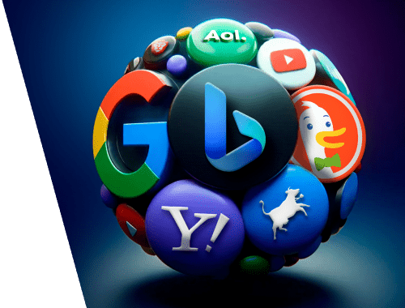

# Why Search Engines Are Favoring Brands Over Websites

Search engines are changing the [**way they rank conten**](http://builtinwashington.com/)t. What used to be a system heavily focused on keywords and backlinks is now increasingly favoring recognizable brands over generic websites.

This shift isn’t just about logos or fancy designs; it’s about credibility, authority, and trust signals that search engines use to decide which results users should see first.

For businesses, this change means that even well-optimized websites can struggle if they lack a strong brand presence. Building authority and recognition has become just as important as technical SEO.

In this article, we’ll explore why search engines are prioritizing brands, how this affects user behavior, and what strategies businesses can implement to stay competitive in this new era.

<figure><figcaption></figcaption></figure>

### The Rise of Brand Authority in Search 

Search engines have evolved beyond simple keyword matching. Algorithms now assess the authority and credibility of a source, giving preference to brands that demonstrate consistency, trustworthiness, and influence. Brand authority is measured through multiple signals, including backlinks from reputable sites, mentions across the web, social engagement, and even public recognition.

This shift means that a brand with moderate keyword optimization but strong authority often outranks a highly optimized but unknown website. Authority isn’t just about size—it’s about recognition, relevance, and a history of delivering reliable information. Search engines aim to connect users with trusted sources, and brands naturally fit that role better than anonymous domains.

Htet Aung Shine, Co-Founder of NextClinic, explains that brand visibility isn’t built overnight. “Search engines don’t just reward reputation; they reward consistency. When your content, design, and communication stay aligned across every channel, you signal reliability. That’s what both users and algorithms respond to — a brand that doesn’t just appear credible, but behaves like it.”

### Why Users Trust Brands More Than Unknown Websites 

User behavior reinforces search engines’ preference for brands. People are drawn to familiar names because they equate recognition with reliability and quality. When a user sees a brand they know in search results, they’re more likely to click and engage, which in turn signals to the search engine that this content is valuable.

Beyond clicks, engagement metrics such as dwell time, repeat visits, and shares indicate that users trust branded content. This creates a compounding effect: the more users engage with a brand, the more search engines favor it, and the more visibility it gains. Unknown websites struggle to achieve this momentum because trust and recognition take time to build.

### E-E-A-T and Its Impact on Brand Favoritism 

Experience, Expertise, Authority, and Trust (E-E-A-T) have become central to how search engines evaluate content. Brands inherently align with these criteria. A recognized brand is more likely to have authoritative authors, verified credentials, and a track record of reliable information—all factors that improve search ranking potential.

In industries like health, finance, and tech, branded content consistently outperforms generic sites because search engines prioritize verified, expert-backed sources. Even if a lesser-known website produces high-quality content, it may be overshadowed by a brand that carries stronger authority signals. For marketers, this emphasizes the need to combine content quality with brand visibility.

### How Search Engines Identify and Favor Brands 

Search engines use a combination of structured and behavioral signals to identify brands. Brand mentions across the web, social proof, and consistent backlinks help algorithms recognize authoritative entities. Features like knowledge panels and schema markup reinforce this identification, connecting your website to a branded entity rather than treating it as an anonymous domain.

AI-driven indexing now allows search engines to associate content with broader brand authority rather than just individual pages. This means brands that maintain a consistent presence, deliver expert content, and earn credible mentions are more likely to dominate search results. For businesses, being recognized as a brand entity is no longer optional—it’s a key factor in long-term visibility.

### Implications for SEO and Content Strategy 

The rise of brand favoritism in search has major implications for how businesses approach SEO. Traditional tactics focused solely on keywords, meta tags, and backlinks are no longer enough. Brands must now integrate recognition-building strategies into their content efforts. This means creating content that is not only optimized for search but also reinforces credibility, expertise, and consistency across channels.

According to Marissa Burrett, Lead Design for DreamSofa, visual identity plays a bigger role in SEO than most realize. “Design is part of how users recognize and remember a brand. When the visual tone of your website, ads, and social media feels cohesive, it builds subconscious trust. That recognition translates into higher engagement and, eventually, better search performance.”

Branded content, thought leadership articles, PR coverage, and partnerships all contribute to authority signals that search engines reward. Smaller brands can compete by targeting niche markets, producing high-quality content that establishes them as experts, and leveraging influencer endorsements to amplify recognition. The goal is to ensure that your brand is consistently seen, cited, and trusted online.

### Future Outdlook: Brands as Gatekeepers of Search Visibility 

As search engines continue to evolve, brands are likely to become even more dominant in search results. AI and entity-based algorithms make it easier for engines to distinguish recognized brands from unknown websites. This trend will favor companies that have built strong, trusted identities and consistently deliver authoritative content.

For small businesses and new entrants, this shift represents both a challenge and an opportunity. The challenge lies in competing against established brands for visibility, while the opportunity is in carving out authority in a niche.

For instance, niche platforms and communities often have an advantage because they speak directly to focused audiences. Sites like RVPostings, which serve a very specific community, show how smaller brands can build deep trust even without massive reach. Search engines recognize this kind of specialized relevance — rewarding precision and authenticity over scale.

Early investment in brand-building, content strategy, and reputation management will be crucial for maintaining long-term search visibility.

### Risks and Challenges for Non-Branded Websites 

Websites without strong brand presence face increasing difficulty in gaining traction. Even well-optimized content can be overlooked if search engines cannot associate it with a credible entity. The risk is amplified in competitive industries where established brands dominate knowledge panels, featured snippets, and AI-powered search results.

Additionally, the reliance on user behavior signals means that unknown websites may struggle to generate the engagement needed to rank consistently. Without brand recognition, earning backlinks, social shares, and repeat traffic becomes harder, creating a compounding disadvantage over time.

### Conclusion 

Search engines are clearly shifting toward favoring brands over anonymous websites. This change reflects both user behavior and the algorithms’ emphasis on authority, trust, and credibility. For businesses, the takeaway is that SEO success is now inseparable from brand-building.

Companies that invest in creating a recognized, authoritative presence online—through consistent content, verified mentions, and strategic partnerships—will have a competitive edge in search results. Unknown websites must pivot their strategy to establish credibility and visibility, or risk being overshadowed by stronger brands. The time to focus on brand authority alongside SEO is now, because the future of search will reward trust, recognition, and expertise above all else.
